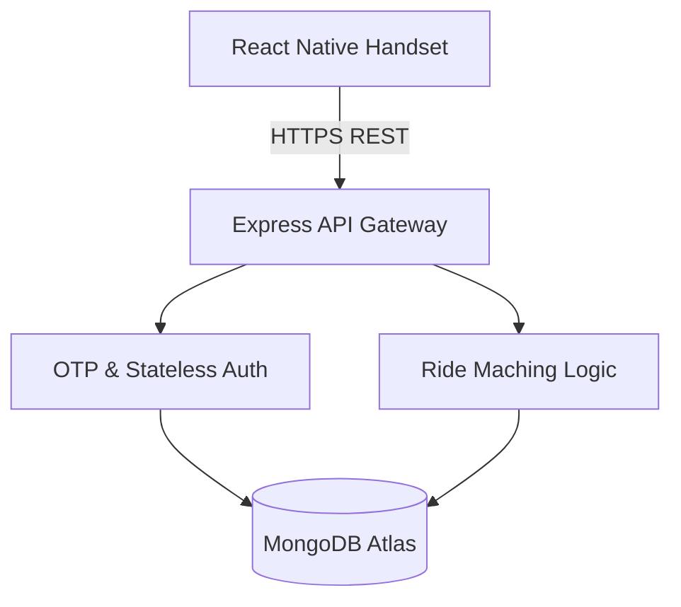

# UniRide: System Architecture Manifest

## Project Vision
**UniRide** is a high-performance, campus-centric, peer-to-peer mobility protocol. It is engineered to facilitate secure, zero-friction ride-sharing among students. By strictly eliminating commercial transaction overhead, credits, and wallets, UniRide operates as a purely decentralized, free-to-use carpooling ecosystem.

## Visual Identity
The platform enforces a strict, **Lamborghini-inspired brand architecture**. The UI/UX prioritizes a premium, aggressive, and minimalist aesthetic. High-contrast themes, dynamic typography, and fluid micro-animations are mandated to ensure visual excellence, robust usability, and immediate operational clarity.

## Architecture Overview
The system relies on strict **Modular Decoupling** to ensure scalability, fault tolerance, and isolated deployment cycles.

- **Frontend (Client Protocol):** A React Native application managed via Expo, leveraging asynchronous geospatial processing and localized security perimeters.
- **Backend (Resource Server):** A highly optimized Node.js/Express.js service backed by Prisma, acting as the singular source of truth and enforcing strict stateless API validation.

## Global Prerequisites
To successfully provision and execute the UniRide protocol in a local development environment, the following dependencies are mandatory. Adherence to these requirements is critical to prevent cascading initialization failures.

- **Node.js** (v18.x or higher)
- **Expo CLI** (Latest version for cross-platform deterministic builds)
- **MongoDB Atlas Access** (Active cluster URI with proper IP whitelisting)

---
**Module Documentation Links:**
- [Client-Side Engineering (Frontend)](frontend/README.md)
- [Server-Side & Persistence (Backend)](backend/README.md)
