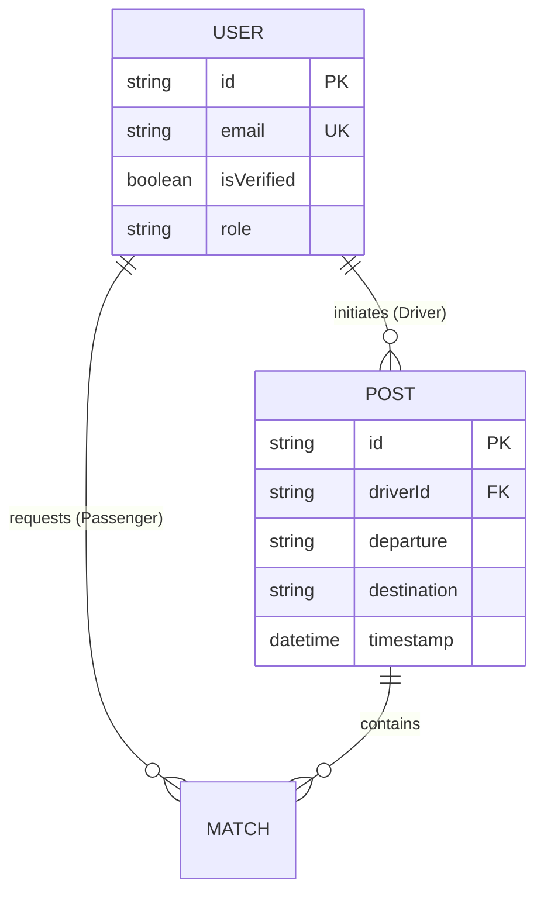

# UniRide: Server-Side & Persistence

This module constitutes the backbone of the UniRide protocol. It operates under a strict no-sugarcoat engineering philosophy: maximize transaction throughput, ensure absolute data integrity, and enforce uncompromising stateless security standards.

## Data Layer & Persistence
The system utilizes a localized single-source-of-truth approach, administered via **Prisma** operating as the ORM layer over a scaled **MongoDB** cluster.

- **Stateless Registration:** Session validation is decoupled from persistent state mechanisms. Accounts remain inert until explicit cryptographic validation of the OTP payload occurs.
- **OTP Validation Logic:** Ephemeral OTP hashes are validated securely without corrupting primary user identity records.
- **Data Pruning:** Money, wallet logic, and commission structures have been surgically excised from the schema to strictly enforce the open peer-to-peer mandate.

## Critical API Documentation

### Authentication Handshake
- `POST /api/auth/request-otp`
  - *Function:* Initiates the Gmail API transport layer and generates an ephemeral, cryptographically secure OTP.
- `POST /api/auth/validate-otp`
  - *Function:* Ingests and verifies the payload, subsequently provisioning a stateless JWT for API consumption.

### User & Identity Management
- `GET /api/users/:id`
  - *Function:* Fetches the combined profile metrics, resolving identity checks and automotive validation parameters in a single query.
- `PATCH /api/users/:id/vehicle`
  - *Function:* Mutates vehicle specifications (make, model, license) and visual hashes.

### Geospatial Ride Matching
- `POST /api/posts`
  - *Function:* Instantiates a new campus route blueprint initiated by a Driver.
- `POST /api/posts/:id/match`
  - *Function:* Executes a Passenger match request against a live route, enforcing strict locking mechanisms to prevent overbooking.

## Infrastructure Strategy
Deployment of the Express routing layer and Prisma client is architected via **Render**. To prevent runtime panic, the environment must be correctly configured to match production integrity standards.

### Environment Variable Requirements
- `DATABASE_URL` — Strictly formatted MongoDB Atlas connection string.
- `JWT_SECRET` — 256-bit cryptographic signature key.
- `GMAIL_USER` — Authorized SMTP transmission identity.
- `GMAIL_PASS` — Authorized App-Specific password configured with explicit boundaries.
- `PORT` — Operational socket port (Standardizes to 3000 mapping on Render instances).

*Warning: Any deviation from these mandatory environmental bindings will result in immediate API instantiation failure.*
