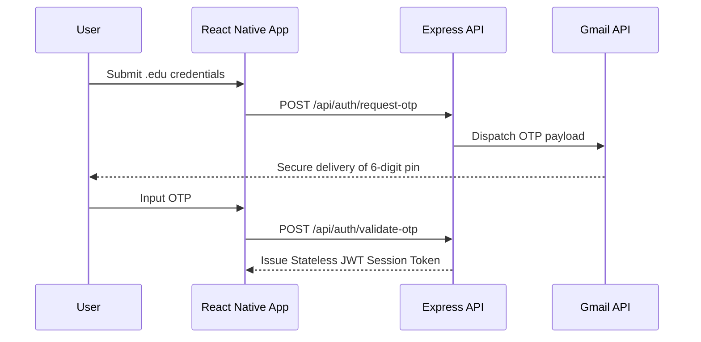

# UniRide: Client-Side Engineering

This module governs the client-side architecture of the UniRide protocol. It adheres to a rigorous engineering philosophy prioritizing aggressive performance optimization, battery-conscious location tracking, and an uncompromised user experience.

## Tech Stack
- **Framework:** Expo (React Native) for deterministic, high-performance cross-platform delivery.
- **UI Architecture:** Accelerated by **Antigravity** for intelligent UI component assembly. This enforces the premium Lamborghini-inspired design system context-wide.
- **Authentication:** **Gmail API Handshake** mechanism ensuring a frictionless and secure OTP delivery matrix.

## Geospatial Logic
Location tracking constitutes the core operational vector of the mobility protocol. To assure real-time spatial accuracy and explicitly prevent production crashes:
- The system employs **Foreground Services** rigidly integrated with the `expo-location` plugin.
- Background execution boundaries are strictly enforced to mitigate battery drain. Foreground polling intervals are aggressively optimized for latency-free driver-passenger synchronization without saturating the JS thread.

## OTP Validation Sequence
The client enforces a robust, stateless authentication handshake prior to any session initialization.



## Build Pipeline
To compile the raw source code into a production-ready Android App Bundle (AAB), execute the following strict command sequence. Ensure keystores are properly provisioned and mapped in `build.gradle` prior to execution.

```bash
# 1. Clean the build environment to prevent artifact collisions
cd android
./gradlew clean
cd ..

# 2. Re-hydrate dependencies
npm install

# 3. Compile the production bundle explicitly
cd android
./gradlew bundleRelease
```
*Output Artifact Locator:* The AAB will be strictly generated at `android/app/build/outputs/bundle/release/app-release.aab`.
